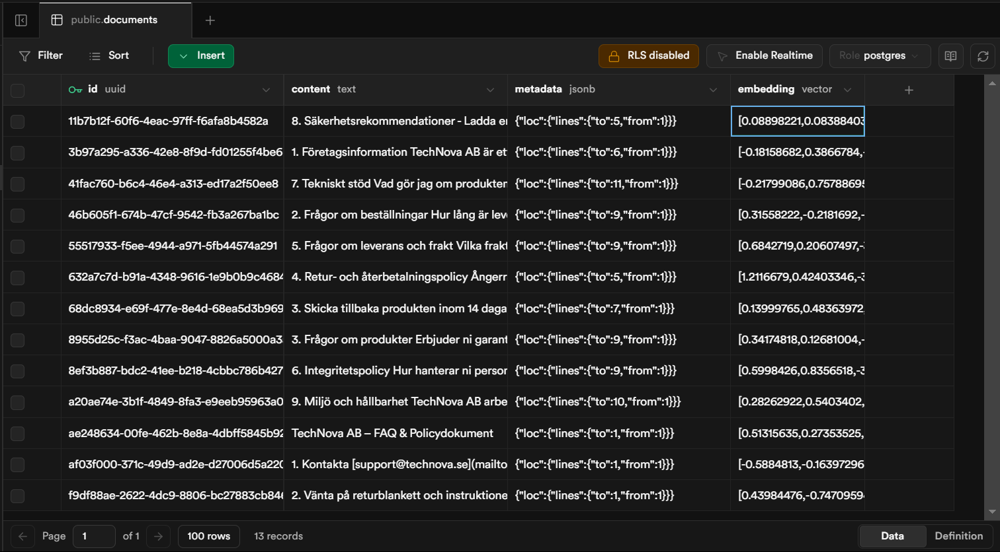

# TechNova AB – Kundtjänstbot (Fullstack JS)

En AI-baserad kundsupportassistent för TechNova AB. Svarar på frågor om produkter, leveranser, returer, garantier, tekniskt stöd och policyer – och visar källhänvisningar från företagets FAQ-/policydokument.

## Teknik
- **React (Vite)** – chat-UI
- **Express** – API
- **LangChain.js**:
  - `ChatPromptTemplate`
  - `RunnableSequence`, `RunnablePassthrough`
  - `RunnableWithMessageHistory` (minne per session)
  - **Router med `RunnableLambda`** (scope-vakt / routing)
- **Supabase + pgvector** – vektorsök
- **Ollama** – lokalt LLM & embeddings

## Varför router med RunnableLambda?
Jag valde att bygga en enkel *scope-vakt* med `RunnableLambda` som avgör om frågan ska köras via QA-kedjan (RAG) eller få ett vänligt avslag. Det här mönstret – en egen router i kedjan – demonstrerar hur man kan styra flödet dynamiskt i LangChain utanför det vi gått igenom i kursen, och det gör beteendet lätt att anpassa (t.ex. byta keyword-logik eller koppla in klassificering senare).

> **Varför inte `RunnableBranch`?**  
> `RunnableBranch` är bra när man har många grenar med separata villkor. I min lösning fanns bara två vägar (RAG eller avslag) och jag ville ha full kontroll över beslutet och kunna göra asynkron logik vid behov. Därför valde jag `RunnableLambda` – enklare att justera keyword-logik nu och byta till klassificering senare.

## Komma igång

### 1) Förkrav
- Node 18+
- Supabase-projekt
- Ollama installerat och modeller:
  ```bash
  ollama pull llama3.2:3b
  ollama pull nomic-embed-text
  ollama serve
```

### 2) Supabase – SQL
Kör `sql/schema.sql` motsvarande (se README i repo) eller:
- Aktivera `pgvector`
- Skapa tabellen `documents` + RPC-funktionen `match_documents` (se koden i server/README).

### 3) Server
- Skapa `server/.env` utifrån `.env.example`:

SUPABASE_URL=...
 SUPABASE_SERVICE_ROLE_KEY=...
 OLLAMA_BASE_URL=http://localhost:11434
 OLLAMA_CHAT_MODEL=llama3.2:3b
 OLLAMA_EMBED_MODEL=nomic-embed-text
 PORT=3001
 CORS_ORIGIN=http://localhost:5173
```
- Kör:
```bash
cd server
npm install
npm run ingest  
npm run dev
```

### 4) Client
```bash
cd client
 npm install
 npm run dev
 ```
Öppna http://localhost:5173

### 5) Skärmdump


## Användning
- Ställ frågor om order, leverans, retur/återbetalning, garanti, tekniskt stöd, integritet/GDPR, säkerhet, miljö/hållbarhet.
- Varje svar med dokumentstöd listar "Källor:" med sektioner ur dokumentet.

## Licens
MIT
